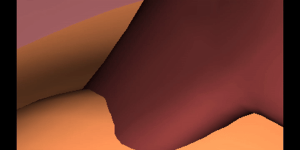
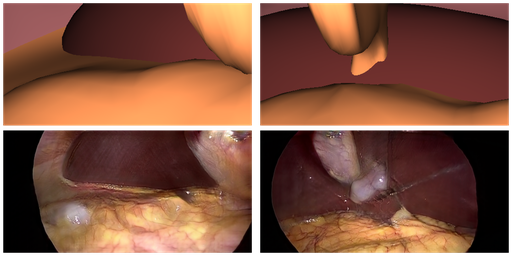

### Controllable Illumination Invariant GAN for Diverse Temporally-Consistent Surgical Video Synthesis

This is the official implementation of our CIIGAN for unpaired synthesis of view-consistent surgical video sequences.



We provided the source code, the model trained on public dataset ChoSeg8K, and 10 3D simulation scenes constructed by us using Blender.

### Conda Environment Setting
```
conda create --name CIIGAN python=3.7
conda install pytorch==1.7.1 torchvision==0.8.2 torchaudio==0.7.2 cudatoolkit=11.0 -c pytorch
```

### Blender Environment Setting
Download the blender-2.83.20-linux-x64.tar.xz
```
sudo tar -xf blender-2.83.20-linux-x64.tar.xz
```
Note: Do not use the original python bundled with blender-2.83.20: blender-2.83.20-linux-x64/2.83/python;
Use the python in the CIIGAN conda env by adding the codes into python script:
```
import sys 
sys.path.append('/anaconda3/envs/CIIGAN/lib/python3.7/site-packages/')
```

### Run Quick Demo
We release the model trained on the public dataset 3D-SimUCL+ChoSeg8K, the model and example test data can be downloaded from
https://1drv.ms/f/c/bcdaf3fbecba991b/EtgZX8TRroBDrF_YsVw9-FEB-cvVfI4xKAPsUafA1xS4tg?e=fYzkcD

Run the following commands to quick test our CIIGAN:
```
cd translation_model
python translate.py 
```
The results will be saved in the directory test_output



### Generating Training and Testing Data
The 3D scenes locate in CIIGAN/simulated_data_generation/ and can be visualized in Blender.
ExampleScene_FakeLiver.blend is the public 3D scene.
Scene1, Scene2, …, Scene10 are our constructed 3D scenes. 

Image, Texture and Mask Generation
```
blender-2.83.20-linux-x64/blender Scene1.blend -b -P renderRandomImages.py -- --images 100 --test_render --texture_patch_size 512
```
This data will be saved to ```data/simulated_images/```. 

Video Sequence, Texture and Mask Generation
```
blender-2.83.20-linux-x64/blender Scene1.blend -b -P renderSequences.py -- --test_render --texture_patch_size 512
```
This data will be saved to ```data/simulated_sequences/```. 

CII Images Generation
```
python CIIGAN/translation_model/RGB2CII.py
```

### Training

After data generation, run the following to train the model:
```
cd translation_model
python train.py --output_path data/Surgical/output/
```

### Testing

After training, run the following to test the model:
```
cd translation_model
python translate.py 
```

### Citation

This paper is under review now. If you use this code, please cite our paper later:

```
@InProceedings{LongChen_2024,
    author    = {Long Chen, Mobarakol Islam, and Thomas Dowrick},
    title     = {Controllable Illumination Invariant GAN for Diverse Temporally-Consistent Surgical Video Synthesis},
}
```

### License

Licensed under the CC BY-NC-SA 4.0 license (https://creativecommons.org/licenses/by-nc-sa/4.0/legalcode).
Copyright (C) 2024 NVIDIA Corporation.  All rights reserved.
Licensed under the CC BY-NC-SA 4.0 license (https://creativecommons.org/licenses/by-nc-sa/4.0/legalcode).
These licenses allow you to use, modify and share the project for non-commercial use as long as you adhere to the conditions of the license above.

### Contact

If you have any questions, do not hesitate to contact us: ```chenlongcv@gmail.com```
